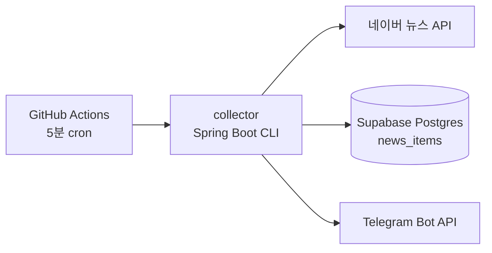

# byun-news-alert

국내 프로농구 FA **변준형** 관련 뉴스를 자동 수집하고, 신규 기사가 있으면 Telegram으로 알려주는 프로젝트입니다.

현재 단계에서는 **collector**(Spring Boot 배치)와 **GitHub Actions** 스케줄만 구현되어 있습니다.  
`web/`(Next.js 대시보드)는 별도 단계에서 추가할 예정입니다.

## 프로젝트 개요

1. GitHub Actions가 5분마다 `collector`를 실행합니다.
2. collector는 네이버 뉴스 검색 API에서 `변준형` 관련 기사를 조회합니다.
3. 제목·설명에 `변준형`과 FA/이적 등 키워드가 포함된 기사만 선별합니다.
4. Supabase Postgres `news_items` 테이블에 저장합니다 (`link` 기준 중복 방지).
5. **신규** 저장된 기사만 Telegram으로 알립니다.
6. 작업이 끝나면 프로세스가 종료됩니다 (상시 API 서버 아님).

## 아키텍처



| 구성요소 | 역할 |
|---------|------|
| GitHub Actions | 스케줄 실행, Secrets 주입 |
| collector | 수집·필터·저장·알림 (1회 실행 후 종료) |
| Supabase Postgres | 뉴스 영구 저장 |
| Telegram | 신규 뉴스 푸시 알림 |

## Supabase 테이블 구조

**테이블명:** `news_items`

| 컬럼 | 타입 | 설명 |
|------|------|------|
| id | BIGSERIAL PK | 자동 증가 ID |
| title | TEXT NOT NULL | 기사 제목 |
| description | TEXT | 기사 요약 |
| link | TEXT NOT NULL UNIQUE | 네이버 뉴스 링크 (중복 방지 키) |
| original_link | TEXT | 원문 링크 |
| publisher | TEXT | 출처(호스트명 등) |
| pub_date | TIMESTAMPTZ | 기사 발행 시각 |
| detected_at | TIMESTAMPTZ | 수집 감지 시각 (기본 NOW) |
| matched_keywords | TEXT[] | 매칭된 키워드 목록 |
| is_alert_sent | BOOLEAN | Telegram 발송 여부 |
| created_at | TIMESTAMPTZ | 레코드 생성 시각 |

## 필요한 환경변수

| 변수 | 용도 |
|------|------|
| `NAVER_CLIENT_ID` | 네이버 검색 API Client ID |
| `NAVER_CLIENT_SECRET` | 네이버 검색 API Client Secret |
| `SUPABASE_DB_URL` | Supabase Postgres JDBC URL |
| `SUPABASE_DB_USERNAME` | DB 사용자명 |
| `SUPABASE_DB_PASSWORD` | DB 비밀번호 |
| `TELEGRAM_BOT_TOKEN` | Telegram Bot Token |
| `TELEGRAM_CHAT_ID` | 알림 수신 채팅 ID |

민감 정보는 코드에 넣지 마세요. 로컬에서는 셸 환경변수로만 주입합니다.

## collector 로컬 실행 방법

### 사전 준비

- Java 21
- Supabase에 `news_items` 테이블 생성 완료
- [네이버 개발자 센터](https://developers.naver.com/)에서 검색 API 앱 등록
- Telegram Bot 생성 및 `chat_id` 확인

### 실행

```bash
cd collector

export NAVER_CLIENT_ID="your-naver-client-id"
export NAVER_CLIENT_SECRET="your-naver-client-secret"
export SUPABASE_DB_URL="jdbc:postgresql://db.xxxx.supabase.co:5432/postgres?sslmode=require"
export SUPABASE_DB_USERNAME="postgres"
export SUPABASE_DB_PASSWORD="your-db-password"
export TELEGRAM_BOT_TOKEN="your-bot-token"
export TELEGRAM_CHAT_ID="your-chat-id"

chmod +x ./gradlew
./gradlew bootRun --no-daemon
```

빌드만 확인할 때:

```bash
cd collector
./gradlew build --no-daemon
```

### 로컬 테스트 순서

1. **빌드 확인** — `./gradlew build --no-daemon` 성공 여부 확인
2. **환경변수 설정** — 위 7개 변수를 export
3. **1회 수집 실행** — `./gradlew bootRun --no-daemon`
4. **로그 확인** — 콘솔에서 아래 항목 확인
   - `뉴스 수집 시작`
   - `네이버 API 조회 결과 개수`
   - `관련 뉴스 개수`
   - `신규 저장 개수`
   - `알림 발송 개수`
5. **DB 확인** — Supabase Table Editor에서 `news_items` 신규 행 확인
6. **중복 실행** — 같은 명령을 다시 실행해 신규 저장·알림이 0인지 확인 (이미 있는 `link`는 스킵)
7. **Telegram** — 신규 기사가 있을 때만 메시지 수신 확인

### 관련 뉴스 판단 규칙

- 제목 또는 설명에 **변준형** 포함 필수
- 아래 키워드 중 **1개 이상** 포함:  
  `FA`, `계약`, `이적`, `잔류`, `영입`, `협상`, `정관장`, `KCC`, `DB`, `LG`, `SK`, `삼성`, `현대모비스`, `KT`, `소노`, `가스공사`
- HTML 태그·entity는 Jsoup으로 제거 후 매칭

## GitHub Secrets 등록 목록

Repository → **Settings** → **Secrets and variables** → **Actions**에서 등록:

| Secret 이름 |
|-------------|
| `NAVER_CLIENT_ID` |
| `NAVER_CLIENT_SECRET` |
| `SUPABASE_DB_URL` |
| `SUPABASE_DB_USERNAME` |
| `SUPABASE_DB_PASSWORD` |
| `TELEGRAM_BOT_TOKEN` |
| `TELEGRAM_CHAT_ID` |

`SUPABASE_DB_URL`은 JDBC 형식이어야 합니다. 예:

`jdbc:postgresql://db.<project-ref>.supabase.co:5432/postgres?sslmode=require`

## GitHub Actions 수동 실행 방법

1. GitHub 저장소 → **Actions** 탭
2. 왼쪽에서 **Collect Byun News** 워크플로 선택
3. **Run workflow** → 브랜치 선택 → **Run workflow**
4. 실행 로그에서 collector 단계 성공 여부 확인

스케줄: `*/5 * * * *` (5분마다, UTC 기준)

## 프로젝트 구조

```
byun-news-alert/
├── collector/                 # Spring Boot 배치 (Java 21)
│   └── src/main/java/com/byun/newsalert/
├── .github/workflows/
│   └── collect-news.yml
└── README.md
```

## 이후 계획

- `web/` — Next.js 기반 뉴스 목록·필터 UI (별도 단계에서 구현 예정)
