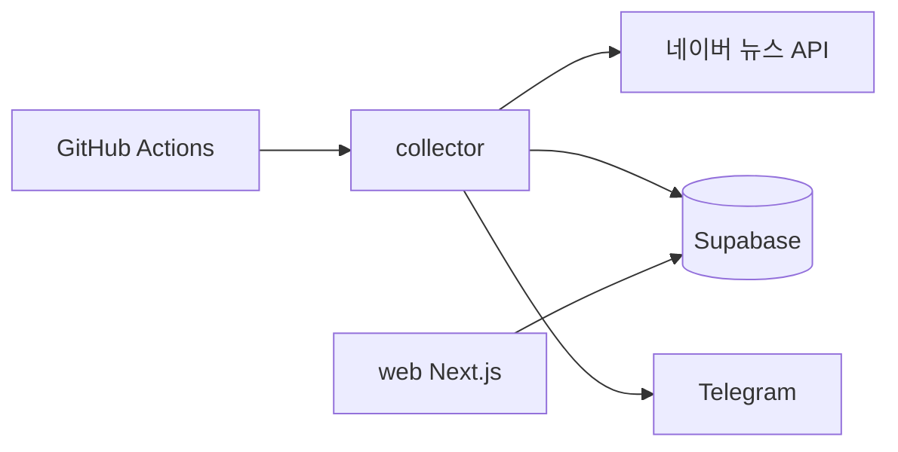

# byun-news-alert

> **운영 종료 (2026 KBL FA 시장 종료)** — 뉴스 수집·Telegram 알림·공개 대시보드는 중단되었습니다.  
> 종료 절차: [`SHUTDOWN.md`](SHUTDOWN.md)

2026 KBL **FA 시장** 관련 뉴스를 자동 수집하고, 신규 기사가 있으면 Telegram으로 알려주던 프로젝트입니다. (아카이브)

- **collector** — Spring Boot 배치 (네이버 뉴스 API → Supabase → Telegram) — **실행 중단**
- **web** — Next.js 공개 피드 — **서비스 종료 안내 페이지**
- **GitHub Actions** — ~~watch 모드~~ **워크플로 삭제됨**

## 프로젝트 개요

1. **cron-job.org**가 10분마다 GitHub Actions `workflow_dispatch`로 collector를 실행합니다. (native schedule은 1시간마다 fallback)
2. collector는 `fa_players`에 등록된 선수 기준으로 기사 관련성을 판단합니다.
3. `APP_NEWS_FROM_DATE`(기본 `2026-05-18`) 이후 기사만 저장합니다.
4. `news_items`에 저장하고, `news_player_mentions`에 선수–기사 관계를 기록합니다.
5. **watch** 모드에서 신규 기사 중 **알림 대상 선수**(기본: 변준형)가 포함된 경우에만 Telegram 알림을 보냅니다.
6. **backfill** 모드는 초기 데이터 적재용이며 Telegram 알림을 보내지 않습니다.
7. **web**에는 KBL FA 전체 선수 뉴스가 표시되며, Telegram은 별도 정책입니다.

## 아키텍처



## Supabase 테이블

### news_items (기존)

| 컬럼 | 설명 |
|------|------|
| id | PK |
| title, description, link (UNIQUE) | 기사 정보 |
| pub_date, detected_at | 발행·감지 시각 |
| matched_keywords | 매칭된 선수명·팀 short_name·공통 키워드 |
| is_alert_sent | Telegram 발송 여부 |

### fa_teams

| 컬럼 | 설명 |
|------|------|
| team_name, short_name | 팀 이름·짧은 이름 |
| match_keywords (TEXT[]) | 팀 식별 키워드 (구단명·브랜드명) |

### fa_players

| 컬럼 | 설명 |
|------|------|
| team_id | FK → fa_teams |
| player_name | 선수명 |
| status | 상태 (예: fa) |

### news_player_mentions

| 컬럼 | 설명 |
|------|------|
| news_item_id, player_id | UNIQUE 쌍 |
| created_at | 생성 시각 |

## FA 팀/선수 seed

파일: [`sql/fa_seed.sql`](sql/fa_seed.sql)

Supabase SQL Editor에서 실행합니다. 팀·선수 예시가 들어 있으며, **실제 2026 FA 대상 선수는 Supabase에서 직접 갱신**하세요.

## collector 모드

| 환경변수 | 기본값 | 설명 |
|----------|--------|------|
| `APP_NEWS_MODE` | `watch` | `watch` 또는 `backfill` |
| `APP_NEWS_FROM_DATE` | `2026-05-18` | 이 날짜(KST 00:00) 이후 기사만 처리 |

### watch 모드

- GitHub Actions 기본 모드
- 검색어 (`application.yml` 기본값):  
  `KBL FA`, `프로농구 FA`, `KBL 자유계약`, `프로농구 자유계약선수`, `변준형 프로농구`, `변준형 KBL`, `정관장 프로농구`
- 검색당 `display=20`, `sort=date`
- 관련성 통과 + `fromDate` 이후만 저장
- **신규** `link` 저장 후, 매칭 선수 중 **알림 대상 선수**가 있을 때만 Telegram 알림
- 변준형이 아닌 FA 뉴스도 `news_items`·`news_player_mentions`에는 저장 (`is_alert_sent=false`)
- 이미 있는 `link`는 저장·알림 스킵, 없는 `news_player_mentions`만 추가

### backfill 모드

- `fa_players` 전체 선수에 대해 검색
- 검색어 (선수별): `{선수명} 프로농구`, `{선수명} KBL`, `{선수명} 농구`, `{선수명} {short_name} 프로농구`  
  (`{선수명} FA` 단독 검색은 사용하지 않음 — 야구 FA 오탐 방지)
- `display=100`, `start=1,101,201…`
- `pubDate`가 `fromDate` 이전이면 **해당 선수·해당 검색어** 페이지네이션 중단
- Telegram 알림 **없음**
- `news_player_mentions`는 반드시 저장

## 수집 정책 (오탐 방지)

### 1. URL 허용 (필수)

본 서비스는 **네이버 스포츠 농구 카테고리 기사만** `news_items`에 저장합니다.

- `link`와 `originalLink`를 모두 검사하며, **둘 중 하나라도** 아래 조건을 만족하면 URL 필터를 통과합니다.
- 허용 host: `m.sports.naver.com`, `sports.naver.com`, `sports.news.naver.com`
- 허용 path: `/basketball/` 포함

허용 예:

- `https://m.sports.naver.com/basketball/article/076/0004407512`

제외 예:

- 일반 언론사 (`kihoilbo.co.kr`, `smarttoday.co.kr` 등)
- 네이버 스포츠 다른 종목 (`/esports/`, `/baseball/`, `/kbaseball/`, `/football/` 등)

### 2. 텍스트 관련성 (URL 통과 후 추가 적용)

URL이 허용되어도 **선수명·농구 문맥·팀 문맥** 필터를 추가로 통과해야 저장됩니다.

### 처리 순서

1. title/description HTML 제거  
2. URL이 네이버 스포츠 농구인지 확인 → 아니면 즉시 스킵  
3. `pubDate` 기준 (`fromDate` 이후만)  
4. 바이라인 제거 후 선수명·농구 문맥·팀 문맥 검사  
5. 매칭 선수 1명 이상일 때만 `news_items` / `news_player_mentions` 저장  

### 수집 로그 (스킵 사유별)

`URL제외` · `농구문맥없음` · `직함/기자제외` · `선수0` · `저장대상` 건수를 구분해 출력합니다.

## 관련성 판단 (텍스트)

`rawText = title + description` → 기자 바이라인 제거 후 `text`로 판단합니다.

```
isRelevantToPlayer =
  hasPlayerMention (실제 선수 언급)
  AND NOT hasExcludedContext (또는 강한 농구 문맥이 있으면 제외 키워드 무시)
  AND (hasStrongBasketballContext OR hasSpecificBasketballTeamContext)
```

### 저장 정책

- **매칭 선수 0명이면 `news_items`에 저장하지 않습니다.**
- **농구 문맥이 없으면** 선수명·FA가 있어도 저장하지 않습니다.
- `LG` / `SK` / `DB` / `KT` / `삼성` / `KCC` / `소노` / `FA` / `계약` / `구단` / `영입` / `이적` / `잔류`는 **단독으로는 팀·농구 식별에 사용하지 않습니다.**  
  강한 농구 문맥이 있을 때만 `matched_keywords` 보조 수집에 씁니다.
- **`{선수명} 기자/특파원/본부장/사장/대표/연구원` 등** 직함·기자 패턴은 선수 언급으로 보지 않습니다.

### 강한 농구 문맥

KBL, 프로농구, 남자농구, 농구, 농구 FA, KBL FA, KBL 자유계약, 프로농구 FA, 자유계약선수 명단, 보수 총액, 샐러리캡 등

### 명확한 농구팀 식별 (기업명·지역명 혼동 적은 키워드)

정관장, 레드부스터스, 프로미, 세이커스, 썬더스, 스카이거너스, 나이츠, 이지스, 소닉붐, 페가수스, 현대모비스, 모비스, 피버스, 한국가스공사, 가스공사

### 제외 문맥

| 구분 | 예시 키워드 |
|------|-------------|
| 야구 | KBO, 투수, NC 다이노스, KT 위즈, LG 트윈스, 홈런, … |
| 금융/기업 | ETF, 코스피, 삼성전자, LG전자, 현대차, 본부장, 네이버, … |

**제외 규칙:** `hasExcludedContext`이고 **강한 농구 문맥이 없으면** 무조건 스킵합니다.  
예: `박민우` + `NC 다이노스` / `KT 위즈` → 야구 기사 제외  
예: `박민우` + `현대차`·`기아` + `본부장` → 경제/기업 기사 제외

## 환경변수

| 변수 | 용도 |
|------|------|
| `NAVER_CLIENT_ID` / `NAVER_CLIENT_SECRET` | 네이버 검색 API |
| `SUPABASE_DB_URL` / `USERNAME` / `PASSWORD` | Postgres JDBC |
| `TELEGRAM_BOT_TOKEN` / `TELEGRAM_CHAT_ID` | Telegram (watch + 알림 대상 선수일 때만) |
| `TELEGRAM_ALERT_PLAYER_NAMES` | Telegram 알림 대상 선수 (쉼표 구분, 기본 `변준형`) |
| `APP_NEWS_MODE` | `watch` / `backfill` |
| `APP_NEWS_FROM_DATE` | 수집 시작일 (예: `2026-05-18`) |
| `APP_NAVER_REQUEST_DELAY_MS` | API 호출 전·후 대기(ms), 기본 `500` |
| `APP_NAVER_MAX_RETRIES` | 429 재시도 횟수, 기본 `3` |
| `APP_NAVER_RETRY_BACKOFF_MS` | 429 재시도 backoff 기준(ms), 기본 `3000` |

### Telegram 알림 정책

| 구분 | 동작 |
|------|------|
| **web 사이트** | `fa_players` 기준 **전체 FA 뉴스** 표시 |
| **Telegram (watch)** | 신규 저장 기사 중 **알림 대상 선수**가 매칭된 경우만 발송 (기본: **변준형**) |
| **Telegram (backfill)** | 발송하지 않음 |
| **is_alert_sent** | 실제 Telegram 발송 성공 시에만 `true` |

알림 대상 선수 확장:

- 환경변수: `TELEGRAM_ALERT_PLAYER_NAMES=변준형,전성현`
- 또는 `application.yml`: `app.telegram.alert-player-names`

```yaml
app:
  telegram:
    alert-player-names: ${TELEGRAM_ALERT_PLAYER_NAMES:변준형}
```

## watch 실행 (로컬)

```bash
cd collector

export APP_NEWS_MODE=watch
export APP_NEWS_FROM_DATE=2026-05-18
export NAVER_CLIENT_ID="..."
export NAVER_CLIENT_SECRET="..."
export SUPABASE_DB_URL="jdbc:postgresql://db.xxxx.supabase.co:5432/postgres?sslmode=require"
export SUPABASE_DB_USERNAME="postgres"
export SUPABASE_DB_PASSWORD="..."
export TELEGRAM_BOT_TOKEN="..."
export TELEGRAM_CHAT_ID="..."

./gradlew bootRun --no-daemon
```

## backfill 실행 (로컬)

```bash
cd collector

export APP_NEWS_MODE=backfill
export APP_NEWS_FROM_DATE=2026-05-18
# (네이버·Supabase 환경변수 동일, Telegram은 불필요하지만 설정돼 있어도 발송하지 않음)

./gradlew bootRun --no-daemon
```

**주의:** backfill은 선수·검색어·페이지 수가 많아 API 호출이 길어질 수 있습니다.

### API 속도 제한 보호 (watch / backfill 공통)

네이버 검색 API 초당 호출 제한(429)을 피하기 위해 collector에 딜레이·재시도가 적용됩니다.

| 환경변수 | 기본값 | 설명 |
|----------|--------|------|
| `APP_NAVER_REQUEST_DELAY_MS` | `500` | API 호출 **전·후** 대기(ms). backfill은 `800` 이상 권장 |
| `APP_NAVER_MAX_RETRIES` | `3` | 429 발생 시 최대 재시도 횟수 |
| `APP_NAVER_RETRY_BACKOFF_MS` | `3000` | 재시도 대기 기준(ms). 1회=3초, 2회=6초, 3회=9초 (선형 backoff) |

- **429**가 계속되면 해당 `query`/`start`(backfill) 또는 `query`(watch)만 스킵하고 다음으로 진행합니다. 전체 backfill은 중단하지 않습니다.
- **401 / 403** 인증 오류는 치명적 오류로 처리해 실행을 중단합니다.

```bash
APP_NEWS_MODE=backfill \
APP_NAVER_REQUEST_DELAY_MS=800 \
APP_NAVER_MAX_RETRIES=3 \
./gradlew bootRun --no-daemon
```

최종 로그에 `naverAPI호출`, `429재시도`, `429스킵` 건수가 포함됩니다.

## GitHub Actions

워크플로: `.github/workflows/collect-news.yml`

- **주 실행:** [cron-job.org](https://cron-job.org)에서 10분마다 `workflow_dispatch` API 호출 (GitHub PAT 필요)
- **fallback:** native schedule `13 * * * *` (UTC, 매시 13분·1시간 간격). 정각 혼잡을 피하기 위해 13분에 실행
- `APP_NEWS_MODE=watch`, `APP_NEWS_FROM_DATE=2026-05-18` 명시
- `workflow_dispatch` 수동 실행 가능

Secrets: `NAVER_*`, `SUPABASE_*`, `TELEGRAM_*` (기존과 동일)

### 기존 Actions 동작 영향

- 스케줄·수동 실행 방식은 동일합니다.
- **수집 범위**가 변준형 단일 키워드 → FA 전체 선수 + watch 검색어 세트로 확장되었습니다.
- Telegram은 **알림 대상 선수**(기본 변준형) 관련 신규 기사만 발송합니다.
- Telegram 메시지에 **관련 선수**·매칭 키워드가 포함됩니다.
- DB에 `fa_teams`, `fa_players`, `news_player_mentions` 데이터가 있어야 합니다.

## web

```bash
cd web
npm install
npm run dev
```

자세한 내용은 [`web/README.md`](web/README.md)를 참고하세요.

## 프로젝트 구조

```
byun-news-alert/
├── collector/
├── web/
├── sql/
│   └── fa_seed.sql
├── .github/workflows/
│   └── collect-news.yml
└── README.md
```
